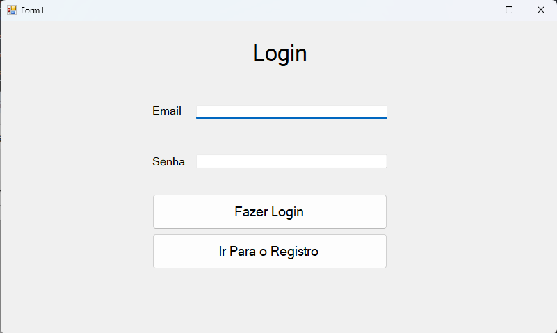
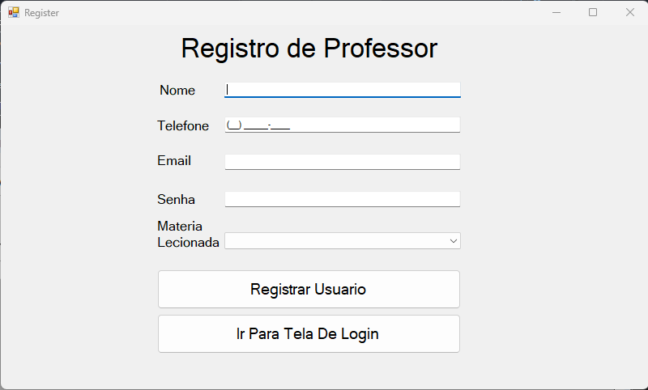
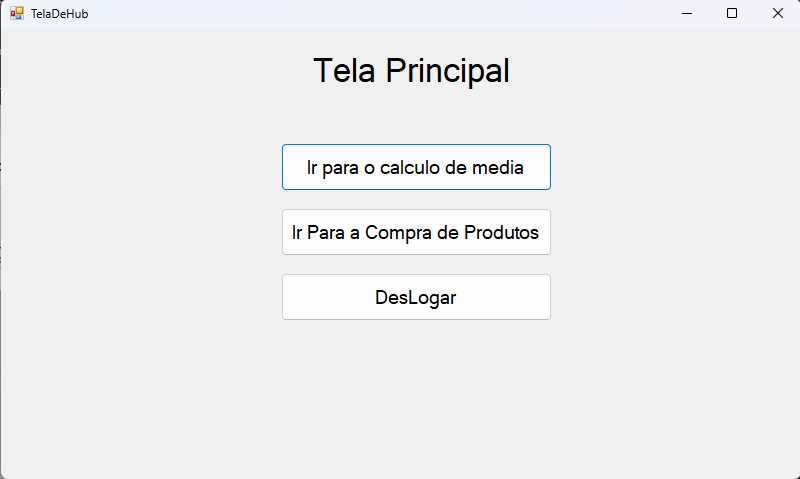
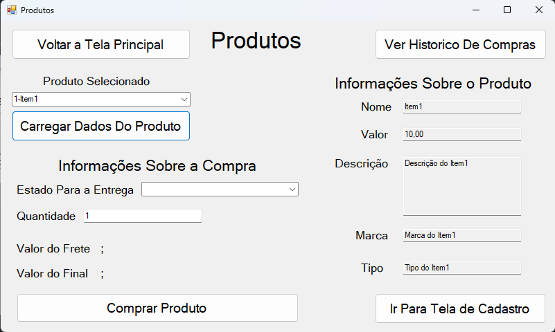
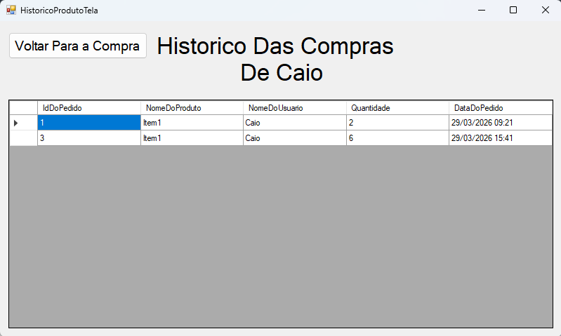
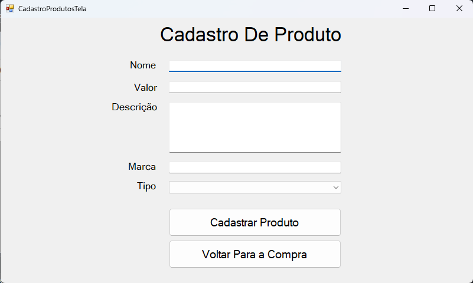
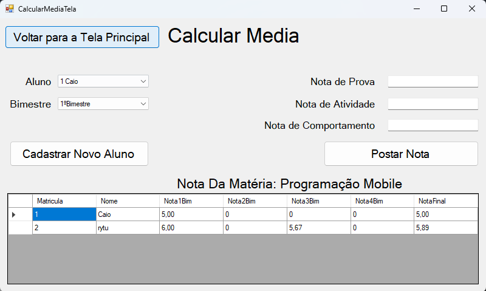
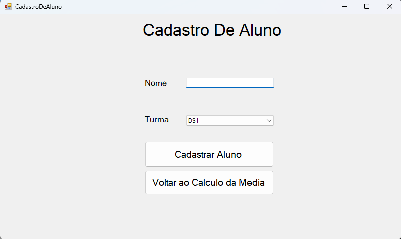

<h1>Projeto_Menção</h1>

<h2>Descrição do Sistema</h2>

  O projeto <b>Project_Mencao</b> consiste em uma aplicação desktop desenvolvida em C# utilizando Windows Forms, composta por três sistemas principais.

<ul>
  <li>
    <b>Sistema de Login:</b> responsável pela autenticação do usuário. O acesso às demais funcionalidades do sistema é liberado após a validação de login e senha.
  </li>

  <li>
    <b>Sistema de Cálculo de Média:</b> permite o registro das notas dos alunos e realiza o cálculo da média final. 
  </li>

  <li>
    <b>Sistema de Produtos:</b> permite o cadastro e a compra de produtos com o cálculo de frete baseado no estado de entrega do pedido.
    O sistema considera os seguintes valores:
    <ul>
      <li>São Paulo: R$ 3,00</li>
      <li>Rio de Janeiro: R$ 5,00</li>
      <li>Bahia: R$ 10,00</li>
      <li>Demais estados: R$ 15,00</li>
    </ul>
  </li>
</ul>

  Esse projeto foi proposto pelo Professor Anderson na aula de Desenvolvimento de Sistemas no Segundo Ano do MTEC em Desenvolvimento de Sistemas.
  O professor orientou que os requisitos poderiam ser expandidos com base no interesse do aluno. Isso resultou nas seguintes expansões:

<ul>
  <li>Implementação de tela de registro de usuários</li>
  <li>Implementação de histórico de compras</li>
  <li>Implementação de sistema de pedidos</li>
  <li>Cadastro de produtos</li>
  <li>Cadastro de alunos</li>
  <li>Criação de uma tela principal (Hub) para navegação</li>
  <li>Integração com banco de dados real</li>
  <li>Expansão do sistema de cálculo de notas</li>
  <li>Melhoria no sistema de compra de produtos</li>
  <li>Adoção de arquitetura em camadas (Layered Architecture), Separation of Concerns (SoC) e organização inspirada em DDD</li>
</ul>

<h2>Imagens do sistema</h2>

  Abaixo estão algumas das principais telas do sistema, com o objetivo de demonstrar sua interface e funcionalidades.

<h3>Tela de Login</h3>

<h3>Tela de Registro</h3>

<h3>Tela Hub</h3>

<h3>Tela de Compra de Produto</h3>

<h3>Tela de Histórico de Compras</h3>

<h3>Tela de Cadastro de Produto</h3>

<h3>Tela de Cálculo de Média</h3>

<h3>Tela de Cadastro de Aluno</h3>

<h2>Estrutura Interna</h2>

<ul>
  <li><b>Models:</b> Representação das entidades</li>
  <li><b>Services:</b> Lógica de Negócio e validação do sistema</li>
  <li><b>Repositories:</b> Acesso ao banco de dados</li>
  <li><b>SQL:</b> Contém scripts responsáveis pela criação e inicialização do banco de dados</li>
  <li><b>Forms:</b> Interface do usuário</li>
  <li><b>Utilidades:</b> Constantes e Enums</li>
</ul>

<h2>Decisões de Design</h2>

<ul>
  <li>Separação entre interface (Forms) e regras de negócio (Services)</li>
  <li>Uso de repositories para abstrair e facilitar o acesso aos dados</li>
  <li>Implementação da regra de negócio no service para o desacoplamento, fácil manutenção e fácil expansão</li>
</ul>

<h2>Possíveis melhorias</h2>

<ul>
  <li>Implementação de uma segurança mais robusta</li>
  <li>Criação de uma API com base nos repositórios para uma possível implementação multi-plataforma</li>
  <li>Melhoria no design da interface e experiência do usuário</li>
</ul>

<h2>Informações Técnicas</h2>

<ul>
  <li>Linguagem : <b>C#</b></li>
  <li>Banco de dados : <b>MySQL</b></li>
  <li>Framework  : <b>.NET (Windows Forms)</b></li>
  <li>Arquitetura: <b>Adoção da arquitetura em camadas (Layered Architecture) com aplicação do princípio de Separation of Concerns (SoC) e com organização inspirada em DDD</b></li>
</ul>

<h2>Como Executar o Projeto</h2>

<ol>
  <li>Clonar o repositório</li>
  <li>Abrir o projeto no Visual Studio</li>
  <li>Configurar a conexão com o banco de dados MySQL</li>
  <li>A conexão do banco de dados está na classe DataBaseConnector, mude o campo de password para a senha do MySQL de sua máquina</li>
  <li>Rodar o script quickstart.sql para criar o banco de dados e tabelas, o script está na pasta SQL</li>
  <li>Executar o projeto</li>
</ol>
